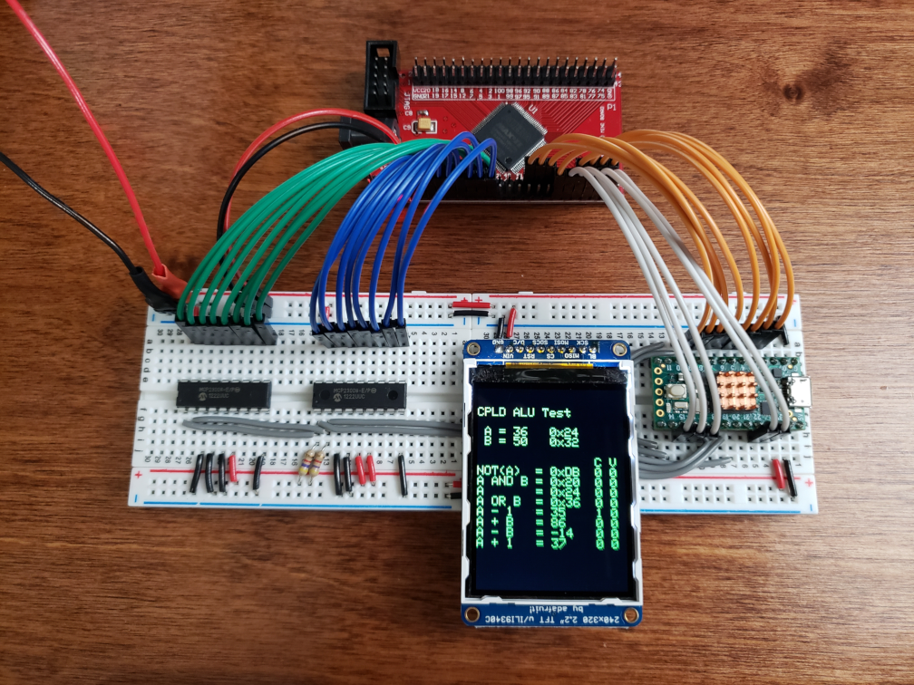
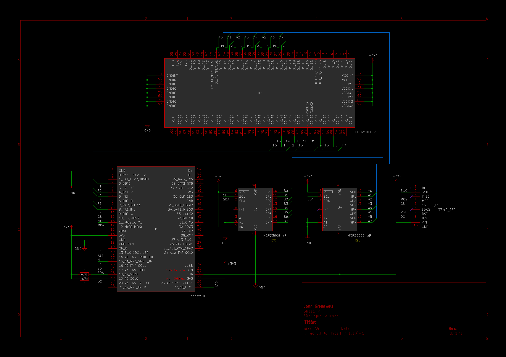

# CPLD ALU Test Project

MAX II CPLD custom ALU with microcontroller interface

## Overview

This test project comprises a custom 8-bit Arithmetic Logic Unit (ALU) written in Verilog and uploaded to an Altera [MAX II EPM240T100C5](https://www.digikey.com/en/products/detail/intel/EPM240T100C5/703853) Complex Programmable Logic Device (CPLD), which is interfaced with a PJRC [Teensy 4.0](https://www.pjrc.com/store/teensy40.html) microcontroller for data exchange and display.



Inputs A and B are delivered to the ALU from the microcontroller via two Microchip [MCP23008 IO Expander](https://www.digikey.com/en/products/detail/microchip-technology/MCP23008-E-P/735951) chips, while the result F and the ALU control lines are connected to the microcontroller directly. Each of the eight control states are cycled for arbitrary inputs A and B, and the results are displayed using an Adafruit [ILI9340 TFT-LCD](https://www.adafruit.com/product/1480) board.

## Usage

The custom ALU may be instantiated as a single generic unit whose bus widths are determined soley by its assigned parameter N, using the Verilog design file [alun.v](src/cpld/alun.v) (and its dependencies). The design format is fully structural, in order to implement the ALU as a very specific succession of logic gates.

```v
module cpld_alu_top
#(
    parameter N = 8
)
(
    input  m,
    input  [1:0] s,
    input  [N-1:0] a,
    input  [N-1:0] b,
    output [N-1:0] f,
    output v,
    output c
);

alun #(N) uut (
    .m(m),
    .s(s),
    .a(a),
    .b(b),
    .f(f),
    .v(v),
    .c(c)
);

endmodule
```

The core test cycle performed by the microcontroller consists of assigning A, B, and the control lines as outputs to the ALU, and querying the results F, Co, and Ov as inputs. Two custom libraries, [mcp23x08.h](src/controller/src/mcp23x08.h) and [virtualport.h](src/controller/src/virtualport.h) are used to handle this IO, and the LCD is operated using the [Adafruit_ILI9340](https://github.com/adafruit/Adafruit_ILI9340) external library. All eight control states are tested in this cycle for any given inputs A and B.

```cpp
// Issue each control command 0-7 and print results
for (int8_t i=0; i<8; i++) {
    control.write(i);
    lcd.print(op_str[i]);
    if (i < 4) // Print in hex for logical
        lcd.printf(" = 0x%0*X  ", 2, port_F.read());
    else       // Print in dec for arithmetic
        lcd.printf(" = %-*i  ", 4, (int8_t)port_F.read());
    lcd.printf("%i %i\n",digitalRead(CO_PIN), digitalRead(OV_PIN));
}
```

## Schematic

The block diagram schematic for the ALU is included as drawn in Cadence Virtuoso software.


The overall schematic for the test setup, along with its associated CAD files are included as composed in KiCad 5.



## License

MIT © 2021 John Greenwell